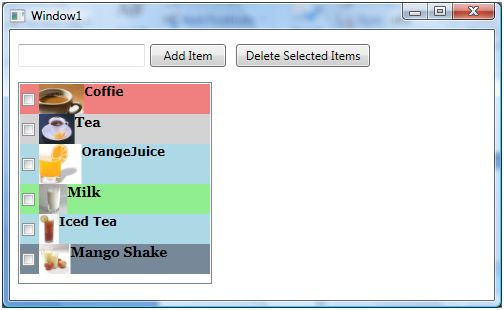
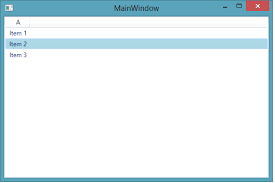
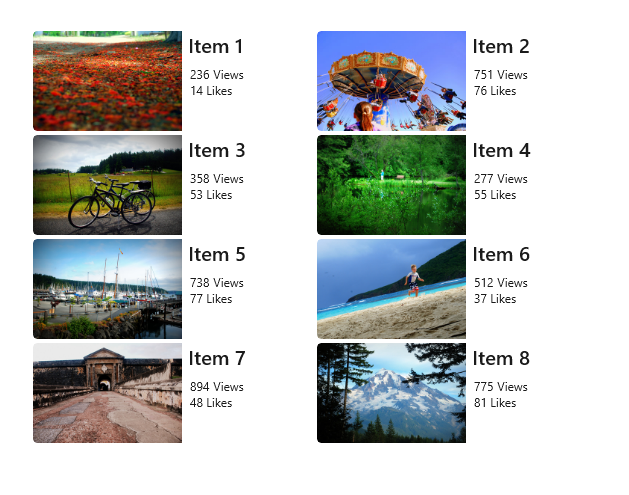
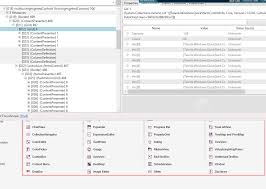
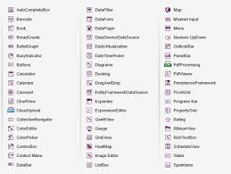

### ListBox и ListView в C# WPF

Сегодня мы разберём два ключевых элемента управления для отображения списков в **WPF** (Windows Presentation Foundation): **ListBox** и **ListView**. Эти контролы часто путают, но они имеют разные сильные стороны. ListView — это, по сути, расширенная версия ListBox, предназначенная для более сложных сценариев отображения данных.

#### 1. ListBox в WPF
**ListBox** — базовый контроль для отображения списка элементов. Он наследует от **ItemsControl**, поддерживает виртуализацию (эффективен для больших данных) и идеален для кастомизации внешнего вида через шаблоны.

**Основные свойства:**
- `ItemsSource`: Источник данных (например, коллекция ObservableCollection).
- `SelectedItem` / `SelectedItems`: Выбранный элемент(ы).
- `SelectionMode`: Single (один), Multiple (множественный простой), Extended (с Ctrl/Shift).
- `ItemTemplate`: DataTemplate для кастомного отображения каждого элемента.
- Поддержка прокрутки (ScrollViewer) и виртуализации по умолчанию.

**Пример простого ListBox (XAML):**
```xml
<ListBox ItemsSource="{Binding People}" SelectedItem="{Binding SelectedPerson}">
    <ListBox.ItemTemplate>
        <DataTemplate>
            <StackPanel Orientation="Horizontal">
                <TextBlock Text="{Binding Name}" FontWeight="Bold" />
                <TextBlock Text=", Возраст: " />
                <TextBlock Text="{Binding Age}" />
            </DataTemplate>
        </ListBox.ItemTemplate>
</ListBox>
```

Вот как выглядит простой ListBox с кастомными элементами:





**Когда использовать:** Для списков с богатой кастомизацией (изображения, кнопки в элементах, горизонтальная/вертикальная ориентация через ItemsPanel). Отлично подходит для не табличных данных.

#### 2. ListView в WPF
**ListView** наследует от **ListBox**, но добавляет свойство **View** для разных режимов отображения. По умолчанию без View он ведёт себя как ListBox (с Extended selection). Главная фишка — встроенная поддержка **GridView** для табличного вида (как таблица с колонками).

**Основные свойства:**
- `View`: Устанавливается в GridView для колонок.
- По умолчанию множественный выбор (Extended).
- GridView позволяет заголовки колонок, сортировку (по клику), перетаскивание колонок.

**Пример ListView с GridView (XAML):**
```xml
<ListView ItemsSource="{Binding People}">
    <ListView.View>
        <GridView>
            <GridViewColumn Header="Имя" DisplayMemberBinding="{Binding Name}" Width="150"/>
            <GridViewColumn Header="Возраст" DisplayMemberBinding="{Binding Age}" Width="80"/>
            <GridViewColumn Header="Город" Width="120">
                <GridViewColumn.CellTemplate>
                    <DataTemplate>
                        <TextBlock Text="{Binding City}" Foreground="Blue"/>
                    </DataTemplate>
                </GridViewColumn.CellTemplate>
            </GridViewColumn>
        </GridView>
    </ListView.View>
</ListView>
```

Вот визуальные примеры ListView с GridView (табличный вид):






**Когда использовать:** Когда нужны колонки с заголовками, простая сортировка или табличное отображение без полного функционала DataGrid (например, без редактирования ячеек).

#### 3. Сравнение ListBox и ListView в WPF

| Характеристика              | ListBox                                      | ListView (с GridView)                               |
|-----------------------------|----------------------------------------------|-----------------------------------------------------|
| **Наследование**            | От ItemsControl                              | От ListBox                                          |
| **Режим выбора по умолчанию**| Single                                       | Extended (множественный с Ctrl/Shift)               |
| **Отображение**             | Гибкое через ItemTemplate и ItemsPanel       | Табличное через GridView (колонки, заголовки)       |
| **Колонки**                 | Нет встроенных (можно эмулировать шаблонами) | Да, полноценные с заголовками и сортировкой         |
| **Кастомизация**            | Максимальная (любые элементы в строке)       | Хорошая, но в GridView ограничена ячейками          |
| **Производительность**      | Отличная с виртуализацией                    | Такая же, но GridView чуть тяжелее для очень больших данных |
| **Типичные сценарии**       | Списки с фото, кнопками, сложным UI          | Таблицы данных (как проводник Windows в Details)    |

Примеры сравнения внешнего вида:






**Важно:** Если нужны редактирование ячеек, сложная сортировка/группировка/фильтрация — лучше использовать **DataGrid** (более мощный, но тяжелее).

#### 4. Рекомендации
- **ListBox**: Для современных WPF-приложений с богатым UI (например, списки чатов, файлов с превью).
- **ListView + GridView**: Для простых таблиц, когда не хочется тянуть DataGrid.
- Всегда используйте MVVM и привязку данных (ItemsSource, Binding).
- Для больших списков — виртуализация включена по умолчанию.
