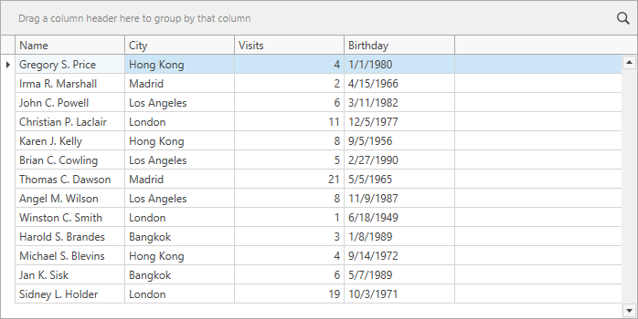
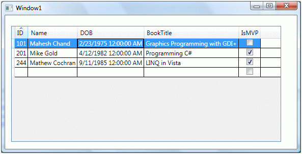

# Коллекции в C#  

Когда вы только начинаете программировать, часто храните данные в простых переменных или массивах. Но в реальных программах нужно работать с большим количеством данных: списки студентов, товары в магазине, сообщения в чате и т.д. Здесь на помощь приходят **коллекции** — специальные классы из .NET, которые позволяют удобно хранить, добавлять, удалять и искать группы объектов.

#### 1. Что такое коллекции и зачем они нужны?

Коллекции — это контейнеры для хранения нескольких элементов одного типа (или разных).

Сравним с обычным **массивом**:

```csharp
int[] numbers = new int[5]; // Фиксированный размер — только 5 элементов
numbers[0] = 10;
// Нельзя легко добавить 6-й элемент — нужно создавать новый массив!
```

Проблемы массивов:
- Фиксированный размер.
- Сложно добавлять/удалять элементы.
- Нет встроенных методов для поиска, сортировки и т.д.

Коллекции решают эти проблемы: они могут автоматически расти, имеют удобные методы и работают быстрее в многих случаях.

#### 2. Виды коллекций в C#

Коллекции находятся в двух основных пространствах имён:

- `System.Collections` — старые, **необобщённые** (non-generic) коллекции. Хранят всё как `object`. Устаревшие, используйте только если работаете со старым кодом.
- `System.Collections.Generic` — современные, **обобщённые** (generic) коллекции. Рекомендуются всегда!


**Почему generic лучше?**
- Типобезопасность: компилятор проверяет типы заранее.
- Лучшая производительность (нет лишних преобразований).
- Нет нужды в приведении типов (casting).

Всегда добавляйте в начало файла:
```csharp
using System.Collections.Generic;
```

#### 3. Основные коллекции и как ими пользоваться

##### 3.1 List<T> — динамический список (самая популярная коллекция)

Аналог массива, но размер меняется автоматически.

```csharp
List<int> numbers = new List<int>(); // Пустой список целых чисел

numbers.Add(10);    // Добавить элемент
numbers.Add(20);
numbers.Add(30);

numbers[0] = 5;     // Доступ по индексу, как в массиве

numbers.Remove(20); // Удалить по значению
numbers.RemoveAt(0); // Удалить по индексу

Console.WriteLine(numbers.Count); // Количество элементов = 1

foreach (int n in numbers)
{
    Console.WriteLine(n);
}
```

Инициализация сразу:
```csharp
List<string> names = new List<string> { "Анна", "Борис", "Виктор" };
```


##### 3.2 Dictionary<TKey, TValue> — словарь (ключ → значение)

Идеально, когда нужно быстро находить значение по ключу (например, телефон по имени).

```csharp
Dictionary<string, int> ages = new Dictionary<string, int>();

ages["Анна"] = 20;
ages.Add("Борис", 22);

Console.WriteLine(ages["Анна"]); // 20

if (ages.ContainsKey("Виктор"))
{
    Console.WriteLine(ages["Виктор"]);
}

// Безопасный способ получения
if (ages.TryGetValue("Борис", out int age))
{
    Console.WriteLine(age); // 22
}
```

##### 3.3 HashSet<T> — множество уникальных элементов

Не допускает дубликаты, быстро проверяет наличие.

```csharp
HashSet<int> uniqueNumbers = new HashSet<int> { 1, 2, 2, 3 }; // 2 добавится только раз
Console.WriteLine(uniqueNumbers.Count); // 3
Console.WriteLine(uniqueNumbers.Contains(2)); // true
```

##### 3.4 Queue<T> — очередь (FIFO: первый пришёл — первый ушёл)

Как очередь в магазине.


```csharp
Queue<string> queue = new Queue<string>();
queue.Enqueue("Первый");
queue.Enqueue("Второй");

Console.WriteLine(queue.Dequeue()); // "Первый"
```

##### 3.5 Stack<T> — стек (LIFO: последний пришёл — первый ушёл)

Как стопка тарелок.

```csharp
Stack<int> stack = new Stack<int>();
stack.Push(1);
stack.Push(2);

Console.WriteLine(stack.Pop()); // 2 (последний)
```

##### 3.6 LinkedList<T> — двусвязный список

Эффективен для частых вставок/удалений в середине.

```csharp
LinkedList<int> list = new LinkedList<int>();
list.AddLast(10);
list.AddFirst(5);
```

#### 4. Как выбрать правильную коллекцию?


- Нужно хранить по порядку и доступ по индексу → **List<T>**
- Быстрый поиск по ключу (имя → значение) → **Dictionary<TKey, TValue>**
- Только уникальные элементы → **HashSet<T>**
- Очередь задач → **Queue<T>**
- Обратный порядок (стек) → **Stack<T>**

#### 5. Перебор элементов и LINQ

Все коллекции поддерживают `foreach`. Также можно использовать **LINQ** для фильтрации, сортировки и т.д.

```csharp
var evenNumbers = numbers.Where(x => x % 2 == 0).ToList();

```

# Роль коллекций в WPF


#### 1. ObservableCollection<T> — основа динамического binding


**Пример 1: Простой ListBox с добавлением/удалением**

XAML (MainWindow.xaml):
```xml
<Window x:Class="WpfApp.MainWindow"
        xmlns="http://schemas.microsoft.com/winfx/2006/xaml/presentation"
        xmlns:x="http://schemas.microsoft.com/winfx/2006/xaml"
        Title="Пример ObservableCollection" Height="400" Width="300">
    <StackPanel Margin="10">
        <ListBox ItemsSource="{Binding Names}" Height="200" />
        <TextBox x:Name="NewNameTextBox" Margin="0,10,0,0" />
        <Button Content="Добавить" Click="AddButton_Click" Margin="0,5,0,0"/>
        <Button Content="Удалить выбранное" Click="RemoveButton_Click"/>
    </StackPanel>
</Window>
```

Код-behind (MainWindow.xaml.cs):
```csharp
using System.Collections.ObjectModel;
using System.Windows;

public partial class MainWindow : Window
{
    public ObservableCollection<string> Names { get; set; } = new ObservableCollection<string>
    {
        "Анна", "Борис", "Виктор"
    };

    public MainWindow()
    {
        InitializeComponent();
        DataContext = this; // Привязываем коллекцию к окну
    }

    private void AddButton_Click(object sender, RoutedEventArgs e)
    {
        if (!string.IsNullOrWhiteSpace(NewNameTextBox.Text))
        {
            Names.Add(NewNameTextBox.Text);
            NewNameTextBox.Text = "";
        }
    }

    private void RemoveButton_Click(object sender, RoutedEventArgs e)
    {
        if (ListBox.SelectedItem is string selected)
        {
            Names.Remove(selected);
        }
    }
}
```

#### 2. Пример с объектами (не просто строками) — DataGrid

Очень часто коллекция содержит объекты с несколькими свойствами.

**Модель:**
```csharp
public class Person
{
    public string Name { get; set; }
    public int Age { get; set; }
    public string City { get; set; }
}
```

**ViewModel или код-behind:**
```csharp
public ObservableCollection<Person> People { get; set; } = new ObservableCollection<Person>
{
    new Person { Name = "Анна", Age = 25, City = "Москва" },
    new Person { Name = "Борис", Age = 30, City = "СПб" },
    new Person { Name = "Виктор", Age = 22, City = "Казань" }
};
```

XAML с DataGrid:
```xml
<DataGrid ItemsSource="{Binding People}" AutoGenerateColumns="False" Height="200">
    <DataGrid.Columns>
        <DataGridTextColumn Header="Имя" Binding="{Binding Name}" />
        <DataGridTextColumn Header="Возраст" Binding="{Binding Age}" />
        <DataGridTextColumn Header="Город" Binding="{Binding City}" />
    </DataGrid.Columns>
</DataGrid>
```




#### 3. MVVM — правильный способ (с отдельным ViewModel)

Паттерн MVVM разделяет логику и интерфейс.


**ViewModel.cs:**
```csharp
using System.Collections.ObjectModel;
using System.ComponentModel;
using System.Runtime.CompilerServices;
using System.Windows.Input;

public class MainViewModel : INotifyPropertyChanged
{
    public ObservableCollection<string> Names { get; set; } = new ObservableCollection<string>
    {
        "Иван", "Мария"
    };

    private string _newName;
    public string NewName
    {
        get => _newName;
        set { _newName = value; OnPropertyChanged(); }
    }

    public ICommand AddCommand { get; }

    public MainViewModel()
    {
        AddCommand = new RelayCommand(AddName); // Простая реализация команды (см. ниже)
    }

    private void AddName()
    {
        if (!string.IsNullOrWhiteSpace(NewName))
        {
            Names.Add(NewName);
            NewName = "";
        }
    }

    public event PropertyChangedEventHandler PropertyChanged;
    protected void OnPropertyChanged([CallerMemberName] string prop = null)
    {
        PropertyChanged?.Invoke(this, new PropertyChangedEventArgs(prop));
    }
}

// Простая команда (можно использовать CommunityToolkit.Mvvm для упрощения)
public class RelayCommand : ICommand
{
    private readonly Action _execute;
    public RelayCommand(Action execute) => _execute = execute;
    public bool CanExecute(object parameter) => true;
    public void Execute(object parameter) => _execute();
    public event EventHandler CanExecuteChanged;
}
```

XAML:
```xml
<Window.DataContext>
    <local:MainViewModel/>
</Window.DataContext>

<TextBox Text="{Binding NewName, UpdateSourceTrigger=PropertyChanged}"/>
<Button Content="Добавить" Command="{Binding AddCommand}"/>
<ListBox ItemsSource="{Binding Names}"/>
```

#### 4. ItemsControl с кастомным шаблоном

Для красивого отображения (например, карточки).


XAML:
```xml
<ItemsControl ItemsSource="{Binding People}">
    <ItemsControl.ItemTemplate>
        <DataTemplate>
            <Border BorderBrush="Gray" BorderThickness="1" Margin="5" Padding="10" CornerRadius="5">
                <StackPanel>
                    <TextBlock Text="{Binding Name}" FontWeight="Bold"/>
                    <TextBlock Text="{Binding Age, StringFormat=Возраст: {0}}"/>
                    <TextBlock Text="{Binding City}"/>
                </StackPanel>
            </Border>
        </DataTemplate>
    </ItemsControl.ItemTemplate>
</ItemsControl>
```

#### 5. CollectionViewSource — фильтрация и сортировка


XAML:
```xml
<Window.Resources>
    <CollectionViewSource x:Key="PeopleView" Source="{Binding People}" Filter="PeopleView_Filter"/>
</Window.Resources>

<ListBox ItemsSource="{Binding Source={StaticResource PeopleView}}"/>
<CheckBox Content="Только взрослые (>18)" IsChecked="{Binding ShowAdultsOnly}" />
```

ViewModel:
```csharp
private bool _showAdultsOnly;
public bool ShowAdultsOnly
{
    get => _showAdultsOnly;
    set
    {
        _showAdultsOnly = value;
        OnPropertyChanged();
        ((CollectionViewSource)Application.Current.FindResource("PeopleView")).View.Refresh();
    }
}

private void PeopleView_Filter(object sender, FilterEventArgs e)
{
    if (e.Item is Person p)
    {
        e.Accepted = !ShowAdultsOnly || p.Age > 18;
    }
}
```

